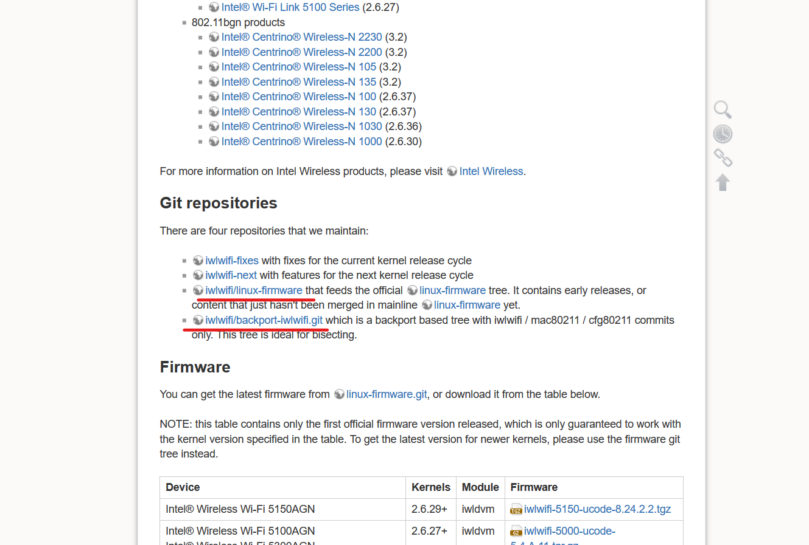

发布日期: 2019-11-12 09:21:45&emsp;&emsp;作者：Onetism &emsp;&emsp; Github:[https://github.com/Onetism/Onetism.github.io](https://github.com/Onetism/Onetism.github.io)

&emsp;&emsp;Ubuntu很多时候受制于显卡和网卡的驱动，以前没有遇到过，最近换了台新电脑，发现显卡也不能用，无线网卡也不能用，弄了好久才解决。

### 1.无法进入桌面
&emsp;&emsp;不管装系统还是装好以后无法进入桌面或者黑屏，在进入`Grub`的时候，在键盘上按e进入编辑引导选项的界面，找到`linux`那一行，后面有`ro quiet splash`,`ro`是是只读的意思，在操作系统开机启动过程中，有些软件是要写入一些信息和数据到系统中的，因此可以尝试改成`rw`,同时为了排除独立显卡的影响因素，在`splash`后面加上`nomodeset`,然后按F10重启，即可进入系统。

&emsp;&emsp;如果想要后面一直按此引导，使用命令`sudo gedit /etc/default/grub`,在其中找到`quiet splash`，在其后面加上`nomodeset`，然后输入`sudo update-grub`，更新grub配置，重新启动即可。

### 2.Intel无线网卡驱动安装
&emsp;&emsp;进入系统以后，发现wifi模块完全不见了，大部分原因是驱动不行，对于Intel的无线网卡驱动，首先去[Intel官网](https://wireless.wiki.kernel.org/en/users/Drivers/iwlwifi)下载[linux-firmware](https://git.kernel.org/pub/scm/linux/kernel/git/iwlwifi/linux-firmware.git),这是最新的驱动，将系统自带的更换为最新的，使用命令：
	
	sudo rm -r /lib/firmware
	sudo mv /home/oneitms/linux-firmware /lib/firmware
	sudo chgrp root /lib/firmware -R
	sudo chown root /lib/firmware -R
	sudo chmod u=rwx,g=rx /lib/firmware -R

&emsp;&emsp;然后安装Intel装载驱动程序，使用命令：

	git clone https://git.kernel.org/pub/scm/linux/kernel/git/iwlwifi/backport-iwlwifi.git 
	cd backport-iwlwifi/
	sudo make defconfig-iwlwifi-public
	sed -i 's/CPTCFG_IWLMVM_VENDOR_CMDS=y/# CPTCFG_IWLMVM_VENDOR_CMDS is not set/' .config
	sudo make -j8
	sudo make install
&emsp;&emsp;最后，重新启动即可，需要注意的是，要先下最新的驱动程序，在安装装载程序，如果系统更新后无线网络又不能使用的话，重新到backport-iwlwifi目录，执行sudo make install.

