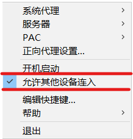
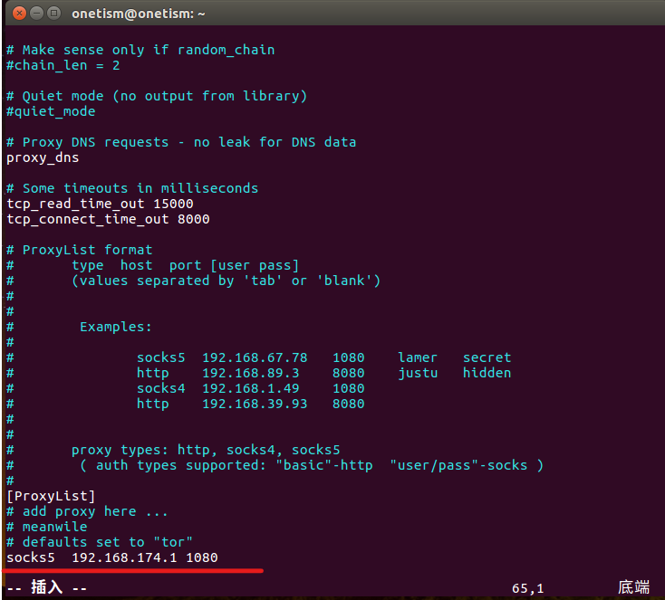
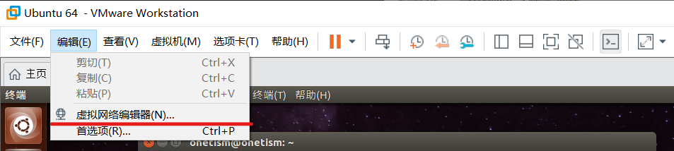
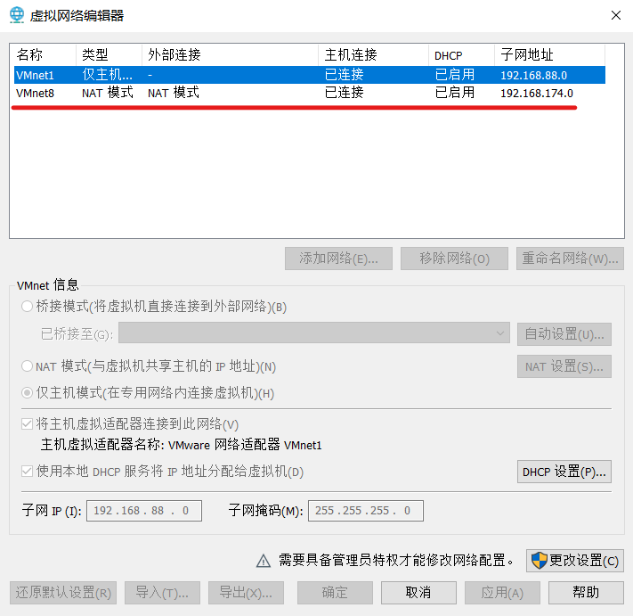
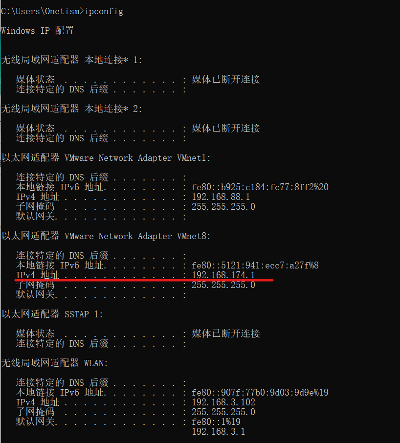
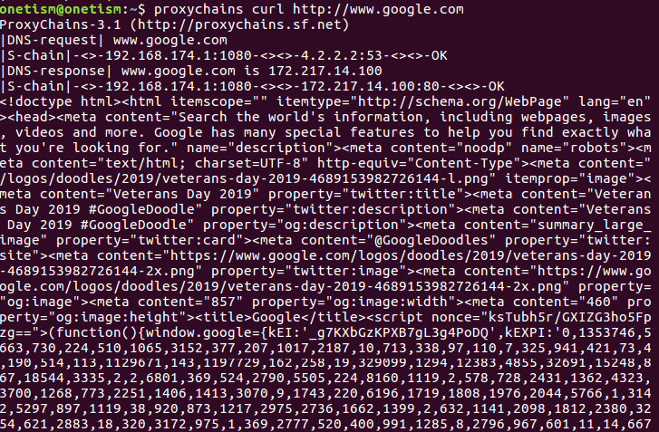
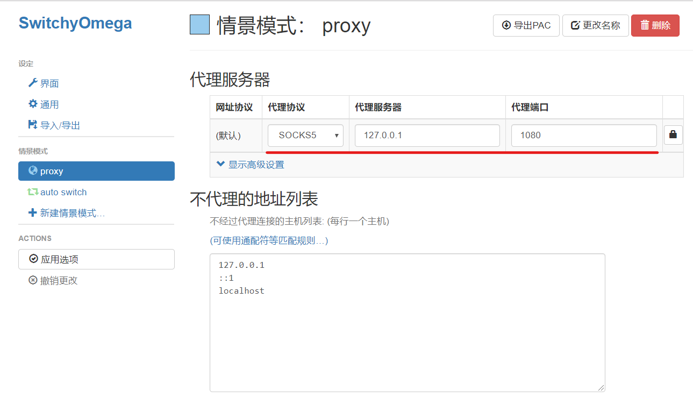

发布日期: 2019-11-12 09:21:45&emsp;&emsp;作者：Onetism &emsp;&emsp; Github:[https://github.com/Onetism/Onetism.github.io](https://github.com/Onetism/Onetism.github.io)

&emsp;&emsp;在VMware中使用终端命令操作时，需要访问国外网站下载内容的时候，由于墙的原因经常会莫名奇妙的失败，因此对于有些命令是要以科学上网的方式获取的。

### 终端代理解决方案
&emsp;&emsp;想要在终端使用代理，首先是要在主机中开启SS,并且要允许其他设备接入，相当于局域网中的设备可以通过主机连接外网。

&emsp;&emsp;安装[ProxyChains](http://proxychains.sourceforge.net/)这个软件，可以直接在终端输入：

    sudo apt-get install proxychains

&emsp;&emsp;然后配置proxychains.conf文件，终端输入：

    sudo vim /etc/proxychains.conf

&emsp;&emsp;在最后的ProxyList里加入Shawdowsocks的代理设置：

    socks5 192.168.174.1 1080

&emsp;&emsp;当中的IP地址是通过主机查看的，主机`Win+R`进入终端，输入`ipconfig`,即会显示所有ip,找到虚拟机上网的方式，因为我用的是NAT方式，对应于VMnet8,所以选择NAT的ip地址。

&emsp;&emsp;配置完成之后，就可以通过`proxychains+命令的方式`实现任意命令通过代理的方式连接上网，例如：

    proxychains curl http://www.google.com

### 浏览器代理方案

&emsp;&emsp;目前 SwitchyOmega 支持 Chrome 和 Firefox 浏览器。只要在浏览器安装插件就能解决问题。安装完成之后，设置情景模式。

&emsp;&emsp;首先代理协议选择SOCKS5,代理服务器ip在虚拟机中的选择和上面一样，主机中的话一般是127.0.0.1，代理端口默认也是1080。

&emsp;&emsp;剩余操作参考[https://proxy-switchyomega.com/settings/](https://proxy-switchyomega.com/settings/)

