发布日期: 2019-11-06 &emsp;&emsp;作者：Onetism&emsp;&emsp;Github:[https://github.com/Onetism/Onetism.github.io](https://github.com/Onetism/Onetism.github.io)

## 环境搭建
### 1.安装[Node.jd](https://nodejs.org/zh-cn/)
&emsp;&emsp;首先，从官网下载稳定版Node.jd，一般选择长期支持版，如下图所示。安装过程全选默认，一路点击<font color=red>`Next`</font>。安装好之后，按下<font color=red>`Win+R`</font>打开命令提示符，输入<font color=red>`node -v`</font>和<font color=red>`npm -v`</font>，如果出现版本号，就证明安装成功。

<div align=center>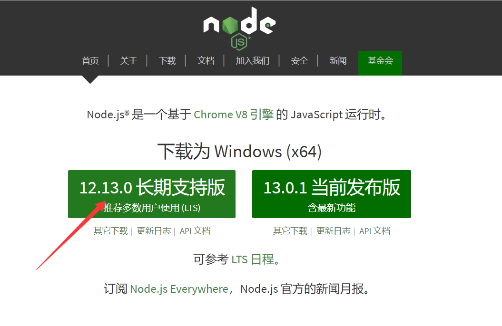</div>

<div align=center>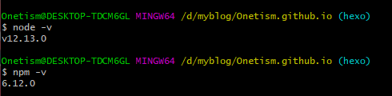</div>

### 2.安装[Git](https://git-scm.com/download/win)
&emsp;&emsp;为了把本地的网页文件上传到github上面去，我们需要用到分布式版本控制工具Git。安装选项还是全部默认,安装完成后在命令提示符中输入<font color=red>`git --version`</font>验证是否安装成功。

<div align=center>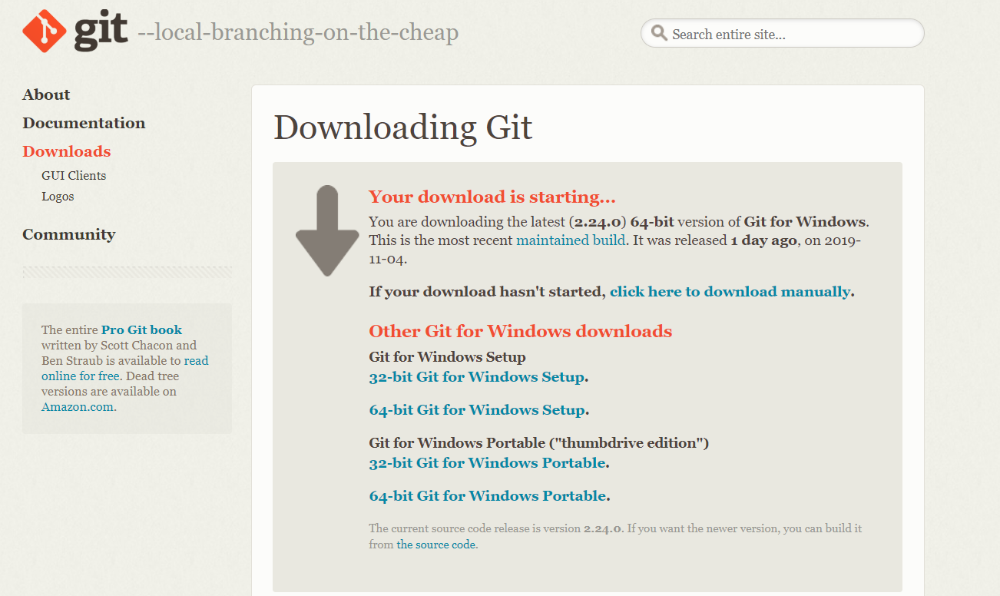</div>

### 3.注册[Github](https://github.com/)账号
&emsp;&emsp;登录自己账号，新建一个仓库，如下图所示。

<div align=center>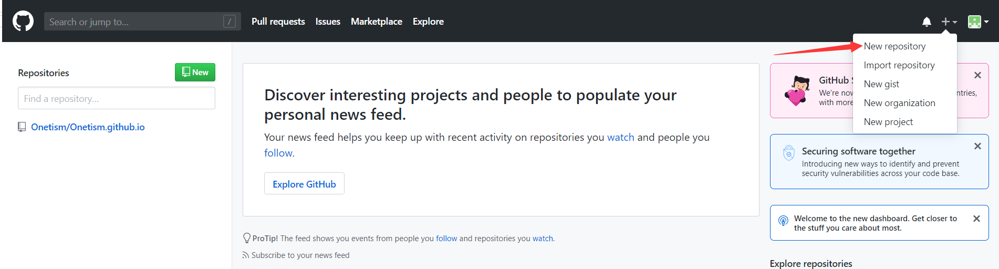</div>

&emsp;&emsp;然后如下图所示，输入自己仓库的名字，后面一定要加<font color=red>`.github.io`</font>后缀，然后README初始化也勾上，<font color=blue>名称要和自己的github名字完全一样，比如我的github名字叫<font color=red>`Onetism`</font>,那么仓库的名字一定是<font color=red>`Onetism.github.io`</font></font>。因为我已经申请过了，所以像是已经存在。

<div align=center>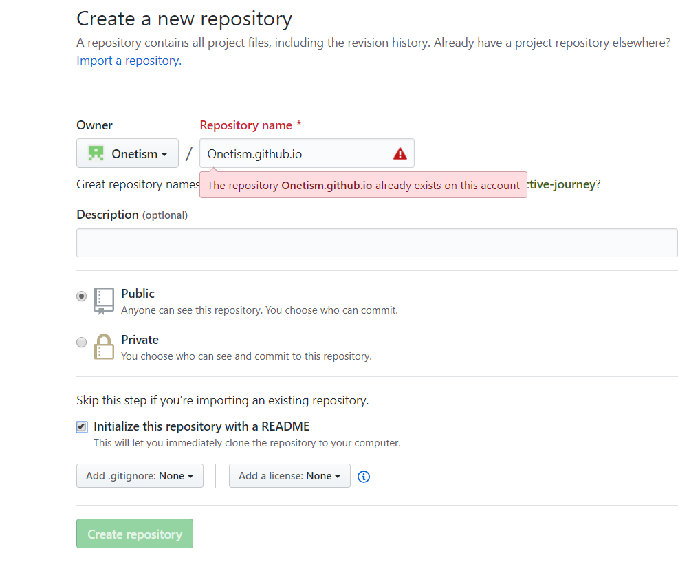</div>

### 4.安装hexo
&emsp;&emsp;自己选择一个位置新建文件夹，作为存放自己的博客文件。然后在该目录右键选择<font color=red>`Git Bash Here`</font>，打开Git的控制台窗口。然后输入<font color=red>`npm i hexo-cli -g`</font>，安装hexo,可能会有几个Warn,略过就行。安装之后输入<font color=red>`hexo -v`</font>,有版本号出现证明安装成功。

&emsp;&emsp;然后初始化自己网站，输入<font color=red>`hexo init`</font>初始化文件夹，就目前来说，进行这个指令是要科学上网的，而且是要让Git控制台直接科学上网，简单的ss/ssr科学上网是下载不了的，可以使用ss/ssr+proxifier实现全局代理，这个就自行谷歌解决了。

&emsp;&emsp;初始化完成之后，接着输入<font color=red>`npm install`</font>,安装必备组件,会多出一个node_modules文件夹。这样本地网站的配置就弄好了。可以尝试输入<font color=red>`hexo g`</font>生成本地的静态网页，然后输入<font color=red>`hexo s`</font>打开本地浏览器，输入[http://localhost:4000/](http://localhost:4000/),就可以看到自己的博客页面，效果如下：

<div align=center>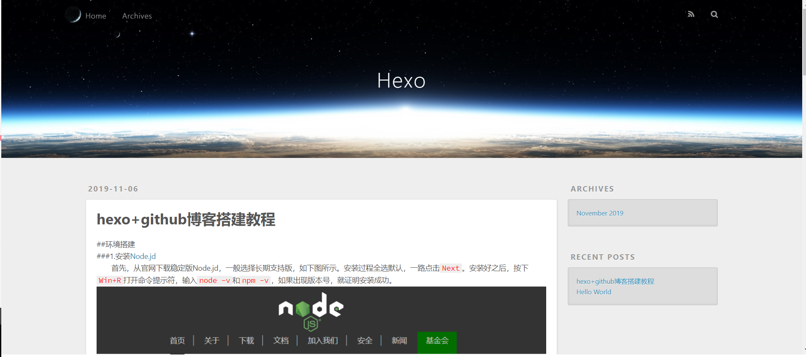</div>

### 5.本地与github连接
&emsp;&emsp;首先，右键打开<font color=red>`Git Bash Here`</font>,,然后输入命令

```
$ git config --global user.name "Onetism"
$ git config --global user.email "onetism@163.com"
```

&emsp;&emsp;双引号内的用户名和邮箱是对应填写自己的就行。接下来生成密钥SSH Key。输入命令

```
$ ssh-keygen -t rsa -C "onetism@163.com"
```

&emsp;&emsp;一直回车，然后登录[Github](https://github.com/),点击自己头像，在点击<font color=red>`settings`</font>，再点击<font color=red>`SSH and GPG keys`</font>，新建一个SSH,名字随便取。

&emsp;&emsp;在Git Bash中输入
 
```
$ cat ~/.ssh/id_rsa.pub
```

&emsp;&emsp;将输出的内容复制到SSH框中，点击确认保存。

<div align=center>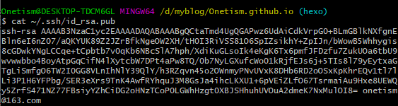</div>

<div align=center>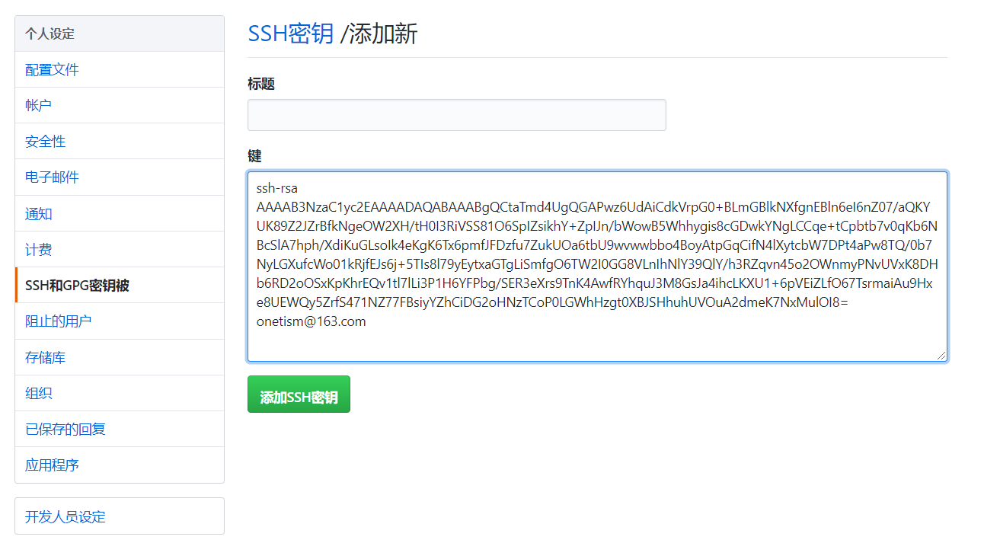</div>

&emsp;&emsp;最后输入<font color=red>`ssh -T git@github.com`</font>，这一步同样需要Git控制台可以科学上网，否则可能出现一直让你输密码，但是怎么输都不对的局面。如果出现下图，就证明成功了。

<div align=center>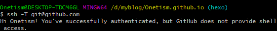</div>

&emsp;&emsp;打开博客目录下的<font color=red>`_config.yml`</font>文件，这是博客的配置文件，这里可以修改与博客相关的各种信息。在最后部分，配置改成：
```
    deploy:
      type: git
      repository: https://github.com/Onetism/Onetism.github.io
      branch: master
```
&emsp;&emsp;<font color=red>`repository`</font>为自己的github项目地址。


### 6.github新建分支备份博客文件
&emsp;&emsp;为了方便博客的更新和数据保存。可以将所有的博客源文件上传到github上面。

&emsp;&emsp;首先在github仓库下面新建一个分支hexo,名字自己随便起，然后git clone到本地，把.git文件拿出来放到博客文件根目录下面，这个文件是隐藏文件，在计算机查看中可以让隐藏文件显示

<div align=center>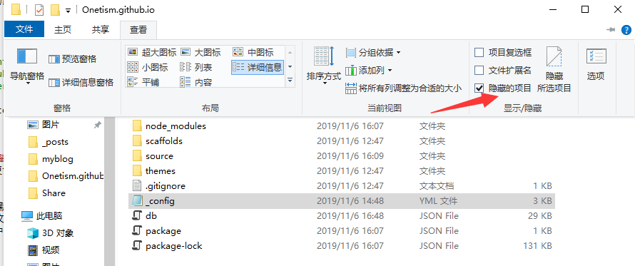</div>

&emsp;&emsp;在github中将hexo分支作为默认分支。
<div align=center>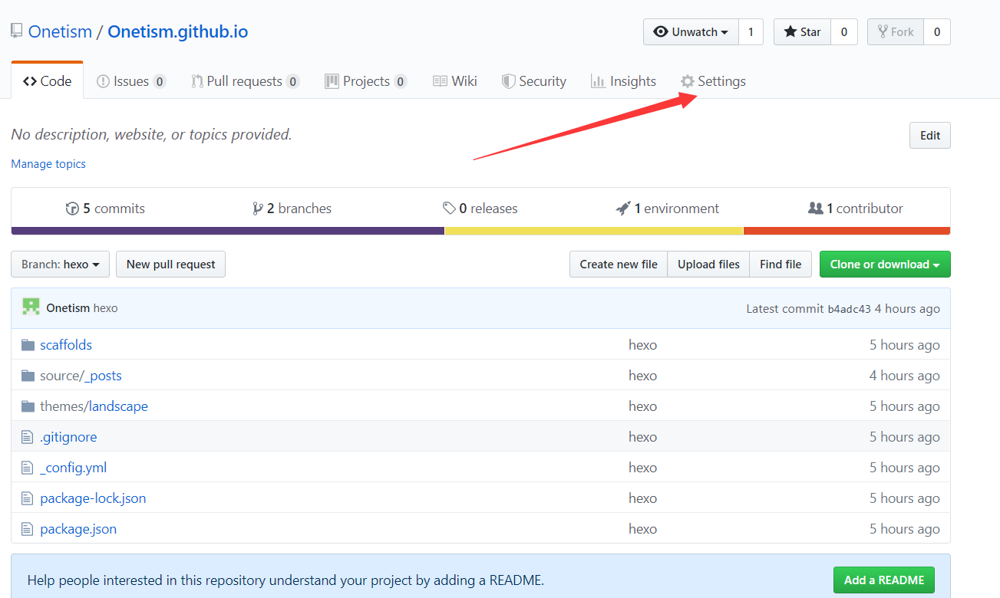</div>

<div align=center>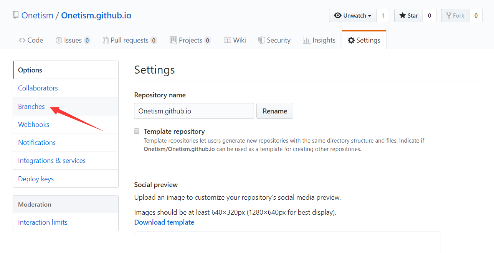</div>

<div align=center>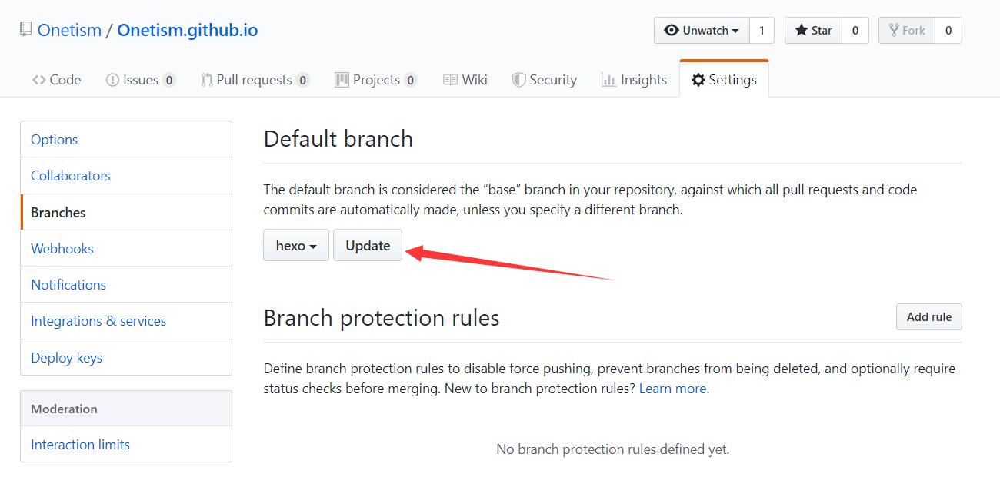</div>

&emsp;&emsp;然后依次执行命令<font color=red>`git add .`</font>，然后<font color=red>`git commit -m "hexo"`</font>，最后<font color=red>`git push --set-upstream origin hexo`</font>提交就行了。这相当于就是上传了。

&emsp;&emsp;每次更换电脑以后，先将hexo分支克隆下来：

```
$ git clone -b hexo https://github.com/Onetism/Onetism.github.io
```

&emsp;&emsp;然后在这个文件下输入以下命令恢复博客：

```
$ npm install hexo-cli
$ npm install
$ npm install hexo-deployer-git
```


&emsp;&emsp;这样就可以编写博客了，编写完成之后，我习惯于可以先备份再生成博客，也可以反过来，因此先执行<font color=red>`git add .`</font>，<font color=red>`git commit -m "hexo"`</font>，<font color=red>`git push --set-upstream origin hexo`</font>，最后执行<font color=red>`hexo g -d .`</font>。

&emsp;&emsp;这样就基本完成了，有些需要下载的卡住的话，一般是科学上网的问题。


